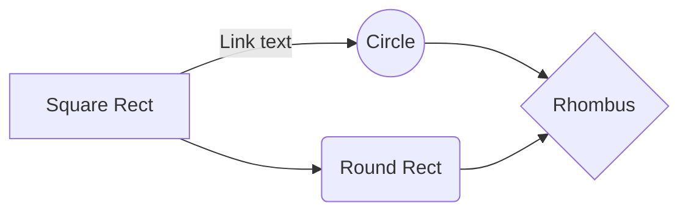

# ReFocus

**ReFocus** is a Google chrome extension designed to help you regain your focus while online!

### Developer's Note
This extension is an extension of a class project [here](https://github.com/COEN-296-Attention-Management-Spr-2023/a3-beta-version-with-user-feedback-focusfive).

## Installation
1. Download the files from here.
2. Go to Extensions -> Manage Extensions OR chrome://extensions/ in a new tab.
3. Turn `Developer mode` on.
4. Load unpacked the folder.
5. The extension's icon should now show up!

## User Guide
The extension works on 2 modes, to keep it simple.
- **Mindful mode**: Popup to confirm redirects.
- **Focus Mode**: Redirects. No warnings.

## Code Structure

